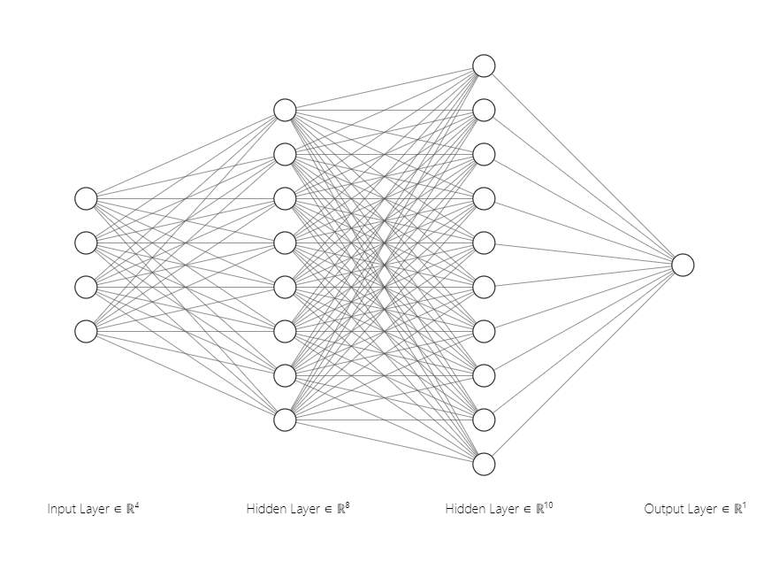
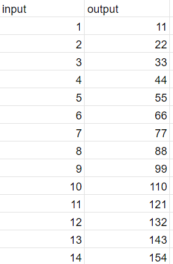
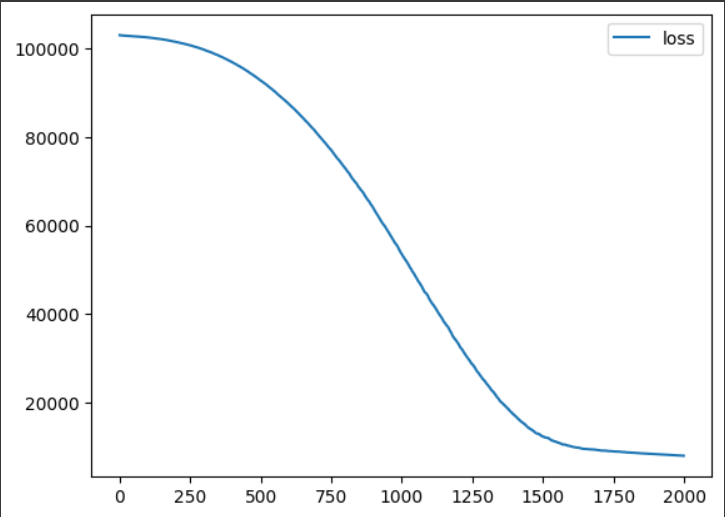
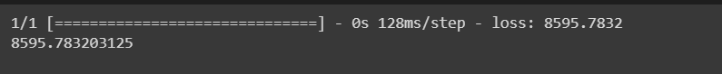
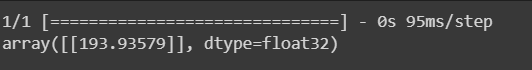

# Developing a Neural Network Regression Model

## AIM

To develop a neural network regression model for the given dataset.

## THEORY

The problem statement revolves around creating a predictive model using a neural network to establish a relationship between input and output data. The dataset consists of input-output pairs stored in a Google Sheets document. The goal is to design a neural network that learns from the input-output patterns in the dataset and can predict the output for new, unseen input values. The input data represents the 'input' variable, and the corresponding output data represents the 'output' variable. The dataset is divided into training and testing sets for model evaluation. The neural network architecture includes multiple layers, such as the input layer, two hidden layers with rectified linear unit (ReLU) activation functions, and an output layer. The model is trained using the mean squared error (MSE) loss function and the RMSprop optimizer. The training progress, as well as the final model's performance on the testing set, is visualized and evaluated. Ultimately, the trained neural network is intended to predict the output for new input values, which is demonstrated by predicting the output for an example input of 4 after appropriate data preprocessing.

## Neural Network Model:



## DESIGN STEPS

### STEP 1:

Loading the dataset

### STEP 2:

Split the dataset into training and testing

### STEP 3:

Create MinMaxScalar objects ,fit the model and transform the data.

### STEP 4:

Build the Neural Network Model and compile the model.

### STEP 5:

Train the model with the training data.

### STEP 6:

Plot the performance plot

### STEP 7:

Evaluate the model with the testing data.

## PROGRAM

```
from google.colab import auth
import gspread
from google.auth import default
import pandas as pd
from sklearn.model_selection import train_test_split
from sklearn.preprocessing import MinMaxScaler
from tensorflow.keras.models import Sequential
from tensorflow.keras.layers import Dense


auth.authenticate_user()
creds, _ = default()
gc = gspread.authorize(creds)

worksheet = gc.open('data').sheet1

rows = worksheet.get_all_values()
df = pd.DataFrame(rows[1:], columns=rows[0])
df1 = df.astype({'input':'float'})
df1 = df.astype({'output':'float'})
df1.head()
x = df1[['input']].values
y = df1[['output']].values
x
y
x_train,x_test,y_train,y_test = train_test_split(x,y,test_size=0.33,random_state=33)
scaler = MinMaxScaler()
scaler.fit(x_train)
x_train1 = scaler.transform(x_train)
x_train1 = scaler.transform(x_train)
ai_brain = Sequential([
    Dense(8,activation='relu'),
    Dense(10,activation='relu'),
    Dense(1)
])
ai_brain.compile(optimizer='rmsprop',loss = 'mse')
ai_brain.fit(x_train1,y_train,epochs=2000)
loss_df = pd.DataFrame(ai_brain.history.history)
loss_df.plot()
x_test1 = scaler.transform(x_test)
ai_brain.evaluate(x_test1,y_test)
x_n1 = [[4]]
x_n1_1 = scaler.transform(x_n1)
ai_brain.predict(x_n1_1)

```

## Dataset Information




## OUTPUT:

### graph:

### Test Data Root Mean Squared Error:

### New Sample Data Prediction:



## RESULT
Thus a neural network regression model for the given dataset is written and executed successfully.